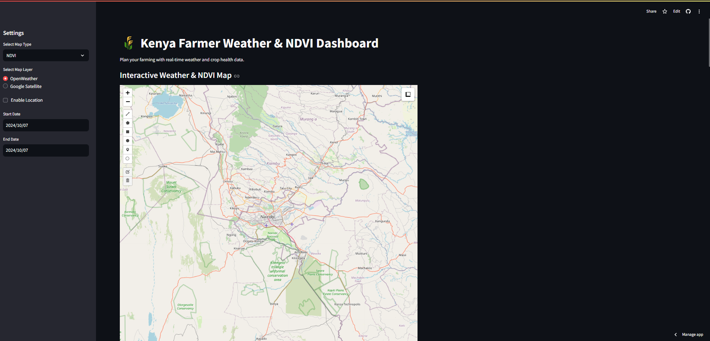

# 🌾 Kenya Farmer Weather & NDVI Dashboard


This project is a **Weather and NDVI Dashboard** designed to help **Kenyan farmers** plan their crop management by using real-time weather and crop health data. The dashboard fetches data from multiple APIs, including NASA's POWER API for weather data and simulated NDVI data for monitoring vegetation health. The project uses **Streamlit** for the user interface and **Folium** for interactive map visualizations.

## Table of Contents
- [Features](#features)
- [Technologies Used](#technologies-used)
- [Installation](#installation)
- [Usage](#usage)
- [How It Works](#how-it-works)
  - [Weather Data](#weather-data)
  - [NDVI Data](#ndvi-data)
  - [Interactive Map](#interactive-map)
- [Generate PDF Report](#generate-pdf-report)
- [Future Enhancements](#future-enhancements)
- [Screenshots](#screenshots)

## Features
- 🌍 **Interactive Map**: Farmers can view weather and NDVI data for any location in Kenya. The map allows drawing polygons or squares to define specific areas of interest.
- 🌦️ **Weather Data**: Real-time weather data (temperature, precipitation, wind speed, and humidity) is retrieved from the NASA POWER API.
- 🌿 **NDVI (Normalized Difference Vegetation Index)**: NDVI values provide insights into the health of crops, helping farmers determine where their maize crops will likely thrive.
- 🗺️ **Map Layers**: Two types of map layers are available: OpenWeather for weather visualization (temperature and precipitation) and Google Satellite for satellite imagery.
- 📄 **Generate PDF Report**: Farmers can generate a PDF report that summarizes weather data and vegetation health for their selected area. The report includes recommendations based on the weather conditions and NDVI values.
- 📅 **Custom Date Selection**: Farmers can select a specific date range for retrieving weather data.

## Technologies Used
- **Streamlit**: Used for creating the interactive dashboard and handling the UI components.
- **Folium**: Used for creating interactive maps with drawing and measuring tools.
- **NASA POWER API**: Provides real-time weather data.
- **Matplotlib**: Used to visualize temperature, precipitation, wind speed, and humidity data.
- **PDF Generation**: Reports are generated in PDF format with weather data visualizations.
- **Python Libraries**: `requests`, `pandas`, `io`, `datetime`, `tempfile`.

## Installation

To run this project locally, follow these steps:

1. Clone the repository:
   ```bash
   git clone https://github.com/TheODDYSEY/Nasa-NDVI-Dashboard
   ```

2. Navigate to the project directory:
   ```bash
   cd Nasa-NDVI-Dashboard
   ```

3. Create a virtual environment:
   ```bash
   python3 -m venv venv
   ```

4. Activate the virtual environment:
   - On macOS/Linux:
     ```bash
     source venv/bin/activate
     ```
   - On Windows:
     ```bash
     venv\Scripts\activate
     ```

5. Install the required packages:
   ```bash
   pip install -r requirements.txt
   ```

6. Run the application:
   ```bash
   streamlit run streamlit_app.py
   ```

## Usage
1. **Select Map Type**: Choose from "NDVI", "Precipitation", or "Temperature" using the dropdown in the sidebar.
2. **Enable Location**: Optionally, enable your location to focus the map on your current coordinates.
3. **Custom Date Selection**: Pick start and end dates to retrieve weather data for a specific period.
4. **Draw on the Map**: Use the drawing tool to mark the area of interest for analysis.
5. **Generate PDF**: After reviewing the weather and NDVI data, click the "Generate PDF" button to download a detailed weather report.

## How It Works

### Weather Data
The app fetches weather data (temperature, precipitation, wind speed, and humidity) from the **NASA POWER API** based on the latitude and longitude of the selected area on the map. Farmers can use this data to make informed decisions about irrigation, fertilization, and other aspects of crop management.

### NDVI Data
The NDVI (Normalized Difference Vegetation Index) is a measure of vegetation health, derived from satellite data. The NDVI value helps farmers understand the quality of their crop growth. The higher the NDVI, the healthier the vegetation. This app simulates NDVI data and gives insights based on those values.

### Interactive Map
The map, powered by **Folium**, allows users to:
- View weather or NDVI data.
- Select different map layers (OpenWeather or Google Satellite).
- Draw polygons or squares to define specific areas of interest.

### Generate PDF Report
Farmers can generate a professional PDF report summarizing the weather data and NDVI insights for their selected area. The report includes recommendations based on the weather parameters and NDVI values, tailored for maize farming.

## Future Enhancements
- Implement real NDVI data from satellite sources.
- Add more detailed weather parameters (e.g., soil moisture, solar radiation).
- Incorporate machine learning models for predicting future crop health and yield.
- Expand the crop options beyond maize.
- Add a database to store user-selected regions and allow farmers to track long-term weather patterns.

## Screenshots
)


